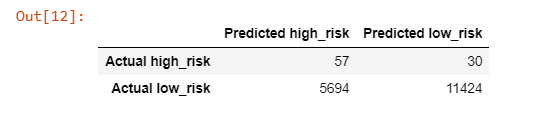

# Credit_Risk_Analysis
Module 17: Supervised Machine Learning and Credit Risk

### Project Overview
In this project, we use Python and jupyter notebook to evaluate different machine learning models which predict credit risk. Then we'll make an evaluation based on their performance. See the deliverables below:

- Deliverable 1: Use Resampling Models to Predict Credit Risk
- Deliverable 2: Use the SMOTEENN Algorithm to Predict Credit Risk
- Deliverable 3: Use Ensemble Classifiers to Predict Credit Risk

### Resources
- Data Source:
- Software: Python, Jupyter Notebook

## Deliverable 1: Use Resampling Models to Predict Credit Risk
- Oversampling RandomOverSampler and SMOTE algorithms
- Undersampling ClusterCentroids algorithm

### RandomOverSampler Model
- Balanced accuracy score: 66%
- High risk precision is around 1% and sensitivity is 66% resulting in an F1 of 2%
- A high number of low risk population results in a precision of 99% and a sensitivity of 67%

### SMOTE Model
- Balanced accuracy score: 63%
- High risk precision is around 1% and sensitivity is 62% resulting in an F1 of 2%
- Again, a high number of low risk population results in a precision of almost 100% but a sensitivity of 64%

### ClusterCentroids Model
- Balanced accuracy score: 51%
- High risk precision is 1% and sensitivity is 59% resulting in an F1 of 1%
- The high number of false positives results in a low risk sensitivity of 43%

## Deliverable 2: Use the SMOTEENN algorithm to Predict Credit Risk
- Balanced accuracy score: 62%
- High risk precision is 1% and sensitivity is 70% resulting in an F1 of 2%
- The high number of false positives results in a the low risk sensitivity of 54%

## Deliverable 3: Use Ensemble Classifiers to Predict Credit Risk

### BalancedRandomForestClassifier Model
- Balanced accuracy score: 78%
- High risk precision is 4% and sensitivity is 67% resulting in an F1 of 7%
- The low number of false positives results in a low risk sensitivity of 91% and 99% presicion

### EasyEnsembleClassifier Model
- Balanced accuracy score: 92.5%
- High risk precision is 7% and sensitivity is 91% resulting in an F1 of 14%
- A low number of false positives results in a low risk sensitivity of 94% with 99% presicion

## Summary
The credit risk analysis models have weak precision to determine if credit risk is high. Though, the Ensemble models have higher sensitivity of the high risk credits.
On the other hand, the EasyEnsembleClassifier model detects high credit risk, but - with a low precision - a considerable number of low risk credits are erroneously detected as high risk, resulting in missed opportunity. As a consequence, I cannot recommend of the models to predict credit risk.
